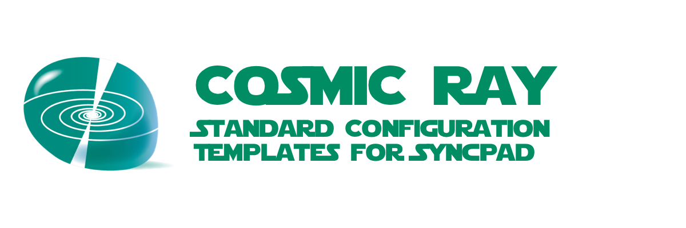

# cosmicray



> **THIS PROJECT IS STILL IN THE DESIGN PHASE**
>
> IDEAS & CONTRIBUTIONS ARE WELCOME
>
> An [Open Source Universe](https://github.com/intellibus/approach) Project

---

## Contents

- [cosmicray](#cosmicray)
  - [Contents](#contents)
  - [Features ✨](#features-)
  - [Install 🛠](#install-)
  - [Usage 🔭](#usage-)
  - [Documentation 🛰](#documentation-)
  - [Contributing 🌎](#contributing-)
  - [License ⚖️](#license-️)

## Features ✨

- ESLint Template `Planned`
- Prettier Template `Planned`
- package.json Template `Planned`
- Sematic Release Config Template `Planned`
- Git Hooks Config Templates `Planned`

## Install 🛠

```sh
npm install cosmicray
```

## Usage 🔭

Read more about the [Design](https://github.com/intellibus/cosmicray/blob/main/DESIGN.md) behind `cosmicray` here.

Add any cosmicray template via your Syncpad Grid as: `cosmicray/template_name`
OR
to your `.syncpad.json` as:

```json
{
  "files": [{
    "template": "cosmicray/template_name"
  }]
}
```

## Documentation 🛰

`cosmicray` *is under active development, documentation will be added once an initial release is ready.*

## Contributing 🌎

We would love for you to contribute your ideas, code, & fixes to `cosmicray`.

We encourage everyone to read our [Design Document](https://github.com/intellibus/cosmicray/blob/main/DESIGN.md) to learn more about the thought process behind cosmicray.

Also check out the [rewards](https://github.com/intellibus/approach/blob/main/REWARDS.md) offered for contributing to the [Open Source Universe](https://github.com/intellibus/approach).

## License ⚖️

MIT
